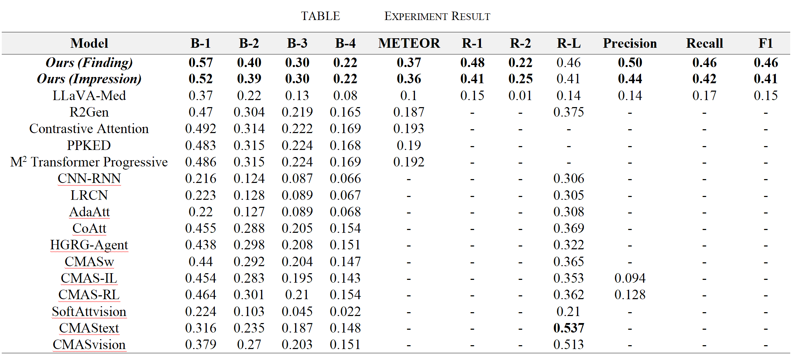

<h1>Abstract</h1>
This paper presents a lightweight framework for generating structured chest X-ray reports by fine-tuning LLaVA-Med with LoRA on the IU X-Ray dataset. Our method achieves state-of-the-art performance across multiple metrics, demonstrating significant improvements in clinical accuracy and semantic coherence compared to existing approaches.

<h1>Get Started</h1>
<h2>1. Required Packages</h2>
Please install the required packages for our model via:

```python
pip install -r requirements.txt
```

<h2>2. LLaVA-Med Deployment</h2>

<h3>(1) Clone this repository</h3>

```python
git clone https://github.com/microsoft/LLaVA-Med.git
```

<h3>(2) </h3>


<h2>Dataset Download</h2>
Load the dataset (image) via:

```Shell
cd data
python download.py
```

The text data has already been cleaned, so users can simply use it. Then we just need to transfer the image path and the text data into a JSON file.
```Shell
python report2json.py
```


<h2>Evaluation</h2>
<h3>Only LLaVA-Med</h3>


<h3>LLaVA-Med + LoRA</h3>


<h2>Main Result</h2>




<h1>Contribution</h1>
The team collaboratively completed this research. The seamless integration of each phase ensured the smooth progression of the research.


