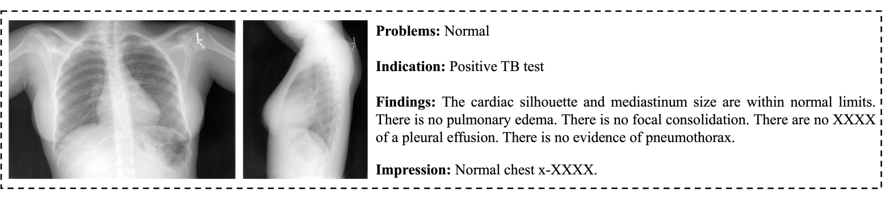

<h1>Abstract</h1>
This paper presents a lightweight framework for generating structured chest X-ray reports by fine-tuning LLaVA-Med with LoRA on the IU X-Ray dataset. Our method achieves state-of-the-art performance across multiple metrics, demonstrating significant improvements in clinical accuracy and semantic coherence compared to existing approaches. To help readers quickly deploy our model, we write this instruction.

<h1>Get Started</h1>
<h2>1. Required Packages</h2>
Please install the required packages for our model via:

```python
pip install -r requirements.txt
```

<h2>2. LLaVA-Med Deployment</h2>

<h3>(1) Clone these two repositories</h3>

```Python
git clone https://github.com/microsoft/LLaVA-Med.git
git clone https://github.com/H1963977384/A-Fine-Tuned-LLaVA-Med-Framework-for-Automatic-Chest-X-ray-Report-Generation.git
```

<h3>(2) </h3>


<h2>Dataset</h2>
<h3>(1) Description</h3>
To achieve the research objectives, this study utilizes the IU X-Ray Dataset. Collected retrospectively between 2011 and 2018 by researchers at Indiana University Health from two large hospital systems within Indiana's patient care network, this dataset was specifically constructed for chest X-ray image understanding and report generation tasks.



<h3>(2) Download and Transform</h3>
Load the image data via:

```Shell
cd data
python download.py
```

The text data has already been processed, so users can simply use it. Then we just need to transfer the image path and the text data into two JSON files (For Train and Test).

```Shell
python report2json.py
```

<h2>Evaluation</h2>
<h3>Only LLaVA-Med</h3>
Please ensure you have already downloaded the dataset and placed under **data** folder.

```Shell
cd /model/eval
python llava.py
```


<h3>LLaVA-Med + LoRA</h3>

```Shell
cd /model/eval
python llava_lora.py
```


<h2>Main Result</h2>


<h1>Contribution</h1>
The team collaboratively completed this research. The seamless integration of each phase ensured the smooth progression of the research.


