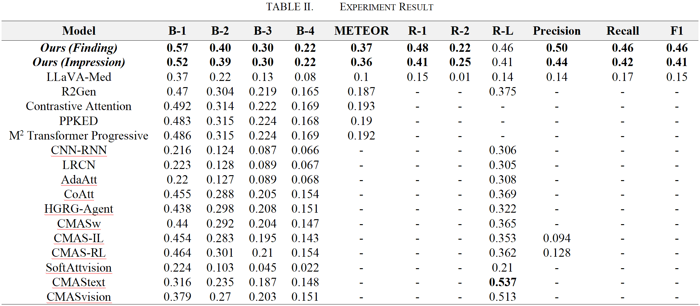

<h1>Abstract</h1>
This paper presents a lightweight framework for generating structured chest X-ray reports by fine-tuning LLaVA-Med with LoRA on the IU X-Ray dataset. Our method achieves state-of-the-art performance across multiple metrics, demonstrating significant improvements in clinical accuracy and semantic coherence compared to existing approaches.

<h1>Get Started</h1>
<h2>1. Install Packages</h2>
Please install the required packages for our model via:

```python
pip install -r requirements.txt
```

<h2>Dataset Download</h2>
s

<h2>Evaluation</h2>
<h3>Only LLaVA-Med</h3>


<h3>LLaVA-Med + LoRA</h3>


<h2>Main Result</h2>




<h1>Contribution</h1>
The team collaboratively completed this research. The seamless integration of each phase ensured the smooth progression of the research.


